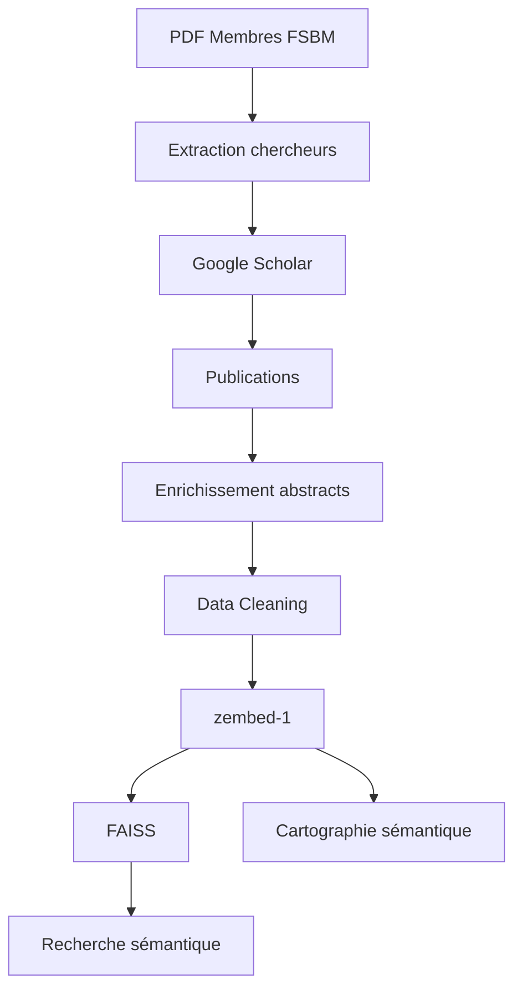

# Cartographie Sémantique et Analyse des Publications de la FSBM

Pipeline Python de bout en bout : **liste des chercheurs (PDF) → profils Google Scholar → publications → abstracts → nettoyage → embeddings `zembed-1` → index FAISS → recherche sémantique → cartographie**.

Projet de Master — Faculté des Sciences Ben M'Sik (FSBM), Université Hassan II de Casablanca.

> **Règle absolue du projet : aucune donnée scientifique n'est inventée.** Toute valeur introuvable (abstract, DOI, métrique, profil) reste `None` / `NaN`, accompagnée d'un champ `*_status` qui explique pourquoi.

---

## Contexte

Évaluer et valoriser la production scientifique des enseignants-chercheurs de la FSBM demande un jeu de données propre et interrogeable. Ce projet automatise sa construction à partir de sources publiques (Google Scholar, Crossref, OpenAlex, Semantic Scholar) et le rend exploitable par du NLP : chaque publication est encodée par le modèle d'embedding **zembed-1** afin de permettre une recherche par le sens, et non par mots-clés.

La liste des chercheurs provient exclusivement du document de référence **« Membres FSBM.pdf »** (colonnes *Etablissement, Enseignant Chercheur, Laboratoire, Equipe, Type Membre*). Aucun nom n'est inventé.

## Objectifs

1. Extraire et normaliser la liste des chercheurs FSBM depuis le PDF ;
2. retrouver **prudemment** leur profil Google Scholar (score de confiance, jamais d'appariement sur le seul nom) ;
3. collecter métriques (citations, h-index, i10-index) et publications ;
4. récupérer un maximum d'abstracts par enrichissement (Scholar → Crossref → OpenAlex → Semantic Scholar) ;
5. nettoyer, dédupliquer et valider (Pydantic) ; produire un rapport qualité ;
6. encoder titre + abstract avec **zembed-1** ; indexer avec FAISS (cosinus) ;
7. rechercher des **publications** et des **chercheurs** par similarité sémantique ;
8. produire une **cartographie sémantique** (UMAP + KMeans) et des analyses descriptives.

## Architecture



Le scraping repose sur une interface `ScholarBackend` : changer de méthode de collecte (`http` = requests + BeautifulSoup, ou `scholarly`) ne demande qu'une ligne dans `config/settings.yaml` (ou `--backend`).

## Technologies

| Domaine | Outils |
|---|---|
| Langage | Python 3.11 / 3.12 |
| Données | pandas, NumPy, PyArrow (Parquet), pdfplumber |
| Collecte | requests + BeautifulSoup (défaut), `scholarly` (alternatif) |
| Validation / config | Pydantic v2, PyYAML, python-dotenv |
| Embeddings | **zembed-1** : poids ouverts officiels (Hugging Face) via `sentence-transformers` + PyTorch — GPU Colab ; API hébergée `zeroentropy` en option |
| Recherche vectorielle | FAISS (`IndexFlatIP`), repli NumPy exact |
| ML / visualisation | scikit-learn (KMeans, PCA, TF-IDF), UMAP, matplotlib, Plotly |
| Notebook / tests | Jupyter, pytest |

> **Selenium n'est pas utilisé** : les pages publiques de profil Scholar sont accessibles en HTTP simple ; Selenium n'apporterait qu'une dépendance lourde et inciterait à contourner les protections de Google, ce que le projet s'interdit.

## Installation

```bash
python -m venv .venv
```

Windows :
```bash
.venv\Scripts\activate
```
Linux / macOS :
```bash
source .venv/bin/activate
```
Puis :
```bash
pip install -r requirements.txt
cp .env.example .env        # Windows : copy .env.example .env
```

Renseignez ensuite `.env` (jamais versionné) :

| Variable | Rôle |
|---|---|
| `ZEROENTROPY_API_KEY` | **Inutile par défaut** (zembed-1 s'exécute en local avec les poids ouverts). Uniquement pour les transports `sdk`/`http` : ZeroEntropy n'accepte plus de nouvelles inscriptions |
| `CONTACT_EMAIL` | Recommandé : identifie vos requêtes auprès de Crossref/OpenAlex (« polite pool ») |
| `SEMANTIC_SCHOLAR_API_KEY` | Optionnel (limite de débit plus élevée) |

Placez `Membres FSBM.pdf` dans `data/input/` (ignoré par Git : document institutionnel).

## Exécution

```bash
python scripts/01_extract_members.py
python scripts/02_scrape_scholar.py
python scripts/03_clean_data.py
python scripts/04_generate_embeddings.py     # zembed-1 en local : GPU requis en pratique → voir « Embeddings sur GPU (Colab) »
python scripts/05_build_index.py
python scripts/06_demo_search.py
```

**Embeddings sur GPU (Colab).** zembed-1 a 4 milliards de paramètres (~8 Go) : sans GPU, l’encodage prend ~2 min par publication (plusieurs jours pour 2 000). Procédure :
1. `python scripts/make_colab_bundle.py` → `outputs/colab/colab_bundle.zip` (code + `publications_clean.parquet` uniquement ; ni `.env`, ni PDF, ni données brutes) ;
2. ouvrir `notebooks/02_colab_embeddings_gpu.ipynb` dans Google Colab (GPU T4), envoyer le zip, exécuter les cellules ;
3. décompresser le `zembed_outputs.zip` téléchargé dans `data/vector_store/`, puis `python scripts/05_build_index.py` (et, si souhaité, `python scripts/04_generate_embeddings.py --attach-only`).

**Un GPU est nécessaire pour le jeu de données complet.** Mesuré sur un portable (i7 4 cœurs, sans GPU utilisable) : environ **2 minutes par publication réelle** (titre + abstract ≈ 250-300 tokens) — plusieurs jours pour 2 000 publications. Le mode CPU (`python scripts/04_generate_embeddings.py`) ne convient qu'à de petits échantillons (`--limit N`) ; le cache SQLite est alimenté après chaque lot, on peut interrompre puis relancer. Sur un GPU gratuit de Colab (T4), l'ordre de grandeur attendu est de quelques minutes (estimation à partir de la puissance de calcul, non mesurée ici). Le modèle est identique dans les deux cas ; seule la durée change. Un autre GPU (Kaggle, station de l'université) convient aussi.

Les 5 requêtes de démonstration sont encodées en même temps et stockées dans le cache : `06_demo_search.py` fonctionne ensuite sans recharger le modèle. Une requête libre demande de charger les poids en local (lent sur CPU).

Étapes complémentaires : `python scripts/07_semantic_map.py` (cartographie), `python scripts/08_descriptive_analysis.py` (graphiques). Toutes les commandes acceptent `--help`.

> **Étape 02 et `robots.txt` de Google Scholar.** Le `robots.txt` de Scholar autorise les pages de profil (`/citations?user=ID`) mais **interdit la recherche d'auteurs par nom** (`Disallow: /citations?`) et la **pagination** (`Disallow: /citations?*cstart=`). Par défaut le projet respecte ces règles : chaque URL est vérifiée avant envoi, la recherche par nom est désactivée et seuls les profils dont le **Scholar ID** est renseigné sont collectés (au plus 100 publications, une seule page).
>
> 1. `python scripts/02_scrape_scholar.py --init-overrides` génère `data/raw/scholar_overrides.csv` (un chercheur par ligne) ;
> 2. renseignez `scholar_id` : c'est la valeur `user=…` de l'URL du profil Scholar (laisser vide s'il n'y a pas de profil) ;
> 3. lancez l'étape 02.
>
> Si vous disposez déjà d'une liste `[{"nom_complet": …, "chercheur_id": <Scholar ID>}, …]` (JSON), `python scripts/import_scholar_ids.py --dry-run` puis `python scripts/import_scholar_ids.py` la rapprochent de la liste du PDF (score de nom, format de l'ID sur 12 caractères, homonymes, autres établissements) et remplissent le CSV ; les entrées douteuses sont signalées, jamais importées (rapport : `outputs/reports/scholar_ids_import_report.json`).
>
> L'option `--allow-author-search` réactive la recherche automatique par nom (avec scoring de confiance, voir *Limites*) : c'est un **choix explicite et sous la responsabilité de l'utilisateur**, le robots.txt l'interdisant. Le backend `scholarly` n'est utilisable que si `respect_robots_txt` est désactivé dans `settings.yaml`.

**Essai rapide sur 3 chercheurs (recommandé en premier) :**

```bash
python scripts/01_extract_members.py
python scripts/02_scrape_scholar.py --init-overrides      # puis renseigner au moins 3 scholar_id
python scripts/02_scrape_scholar.py --limit-researchers 3 --max-publications 10
python scripts/03_clean_data.py
python scripts/make_colab_bundle.py                   # puis notebook Colab (voir ci-dessus) pour l'encodage zembed-1
python scripts/05_build_index.py
python scripts/06_demo_search.py
```

Options utiles de `02_scrape_scholar.py` : `--init-overrides`, `--limit-researchers N`, `--max-publications N`, `--only "Nom"` (chercheur précis), `--resume` / `--no-resume`, `--backend http|scholarly`, `--no-details`, `--skip-enrichment`, `--enrich-only`, `--allow-author-search`.

## Structure

```
fsbm-semantic-publications/
├── config/settings.yaml          # tous les paramètres (délais, seuils, modèle, k…)
├── data/
│   ├── input/                    # Membres FSBM.pdf (non versionné)
│   ├── raw/                      # chercheurs_fsbm.csv, scholars_raw.json, publications_raw.json, cache/
│   ├── processed/                # *_clean.csv, publications_clean.parquet, dataset_final.json
│   └── vector_store/             # embeddings.npy, index FAISS, cache des requêtes (versionnés : livrables)
├── notebooks/01_pipeline_demo.ipynb
├── src/
│   ├── data/                     # extraction PDF, scraping Scholar (parsing/matching/backends), enrichissement, schémas Pydantic
│   ├── preprocessing/            # text_cleaner.py, data_cleaner.py
│   ├── embeddings/zembed_client.py
│   ├── search/                   # vector_store.py (FAISS), semantic_search.py
│   ├── analysis/                 # descriptive_analysis.py, semantic_map.py
│   └── utils/                    # config, logger, retry/backoff, I/O atomique
├── scripts/01…08_*.py            # CLI argparse
├── tests/                        # pytest (aucun accès réseau)
└── outputs/{figures,logs,reports}
```

## Dataset

**Tables logiques** : `researchers` (`chercheurs_clean.csv`), `publications` (`publications_clean.{csv,parquet}`, une ligne par article dédupliqué) et `researcher_publications` (`researcher_publications.csv`, lien N-N : un article co-signé par plusieurs chercheurs FSBM n'est stocké qu'une fois).

**`dataset_final.json`** (structure demandée) :

```json
{
  "chercheur_id": "<Scholar ID unique>",
  "chercheur_id_interne": "fsbm_prenom_nom",
  "scholar_id": "<Scholar ID unique>",
  "nom_complet": "Prénom Nom",
  "affiliation": "…",
  "laboratoire": "…",
  "equipe": "…",
  "scholar_profile_status": "matched",
  "profile_match_confidence": 0.9,
  "metriques": { "citations_totales": null, "h_index": null, "i10_index": null,
                 "citations_since_2021": null, "h_index_since_2021": null, "i10_index_since_2021": null },
  "articles": [
    { "article_id": "art_00001", "titre": "…", "auteurs": ["…"], "date_publication": "2021-01-01",
      "journal": "…", "citations": null, "doi": null,
      "abstract": "texte brut", "abstract_clean": "texte nettoyé", "abstract_status": "found",
      "embedding_source": "title_abstract", "embedding_zembed1": [ "…" ] }
  ]
}
```

(les `null` ci-dessus illustrent la structure ; ce ne sont pas des valeurs réelles.)

**Champs de statut** : `scholar_profile_status` (`matched`, `ambiguous`, `not_found`, `blocked`, `error`), `profile_match_confidence` ∈ [0,1], `collection_status`, `abstract_status` (`found`, `truncated`, `too_short`, `not_found`, `api_error`, `publisher_unavailable`), `abstract_source` (`google_scholar`, `crossref`, `openalex`, `semantic_scholar`, `publisher_page`), `embedding_source` (`title_abstract` | `title_only`), `date_precision` (`day` | `month` | `year`).

**Métriques « depuis 2021 »** : Scholar affiche « Since *(année courante − 5)* ». Les champs `*_since_2021` ne sont renseignés que si la fenêtre lue sur la page vaut réellement 2021 ; sinon ils restent `None` et les valeurs génériques sont dans `*_since` avec `since_year`.

**Nettoyage** : `abstract` = texte brut jamais modifié ; `abstract_clean` = minuscules, sans HTML/JATS, sans étiquette « Abstract », sans « … » de troncature, symboles scientifiques (α, µ, ±, °) conservés. **Pas de suppression de stop-words ni de stemming** (inutiles et nuisibles avec des embeddings modernes). Déduplication : DOI normalisé → titre normalisé + année → flou prudent (seuil 0,93) ; jamais deux DOI différents, jamais « Part I » / « Part II ».

**Rapport qualité** : `outputs/reports/data_quality_report.{json,md}` (% sans abstract, % chercheurs sans Scholar, doublons fusionnés, publications avec DOI, abstracts récupérés par source, erreurs de scraping, erreurs de validation).

**Données versionnées** : tout ce qui est demandé comme livrable l'est — CSV/JSON/Parquet de `raw/` et `processed/`, `dataset_final.json` **avec** les vecteurs `embedding_zembed1` (schéma du sujet), `data/vector_store/` (embeddings zembed-1 `n × 2560`, index FAISS, correspondance `vector_id → article_id`, cache des requêtes de démonstration), figures et cartes interactives. Restent hors Git : `.env`, le PDF institutionnel `Membres FSBM.pdf` et le cache de scraping (`data/raw/cache/`).

## Recherche sémantique

```python
from src.search.semantic_search import semantic_search
semantic_search("deep learning for medical imaging", top_k=5)
```

1. la requête est encodée par **zembed-1** avec `input_type="query"` (les publications l'ont été avec `input_type="document"`) ;
2. similarité cosinus (vecteurs normalisés L2, `IndexFlatIP` exact) ;
3. résultat : `rank, score, article_id, titre, chercheurs FSBM, année, journal, laboratoire, équipe, citations, abstract court, DOI/URL`.

**Recherche de chercheurs** (`engine.search_researchers`) : les 100 publications les plus proches sont retrouvées, puis le score d'un chercheur est la **moyenne de ses 3 meilleures similarités** (places manquantes = 0). Un chercheur avec plusieurs publications proches passe donc devant un chercheur avec une seule publication très proche. Le classement est entièrement fondé sur les embeddings, pas sur le nom du laboratoire.

Démonstration : `python scripts/06_demo_search.py` exécute les 5 requêtes du sujet (*deep learning for medical imaging*, *natural language processing*, *machine learning for cancer diagnosis*, *renewable energy materials*, *environmental pollution*) et écrit `outputs/reports/demo_search_results.{md,json}`.

### Intégration de zembed-1 (vérifiée dans la documentation officielle et la fiche Hugging Face)

**Contexte.** ZeroEntropy (éditeur de zembed-1) a été racheté et n'accepte plus de nouvelles inscriptions : aucune nouvelle clé API n'est obtenable. Le modèle reste toutefois publié en **poids ouverts** ; le projet les exécute donc directement. C'est **le même modèle zembed-1** (pas un substitut), et le client refuse toute autre valeur.

| Point | Valeur |
|---|---|
| Modèle | `zembed-1` (ZeroEntropy) — toute autre valeur lève une erreur (aucun remplacement silencieux) |
| Poids ouverts (transport `local`, **défaut**) | `zeroentropy/zembed-1-embedding` sur Hugging Face — licence **Apache-2.0**, 4 Md de paramètres, base Qwen3-4B, révision épinglée (`cf13c81f…`) |
| Chargement | `SentenceTransformer(..., trust_remote_code=True, model_kwargs={"torch_dtype": …})` ; `encode_query` (requêtes) / `encode_document` (publications) |
| Code distant | `modeling_zembed.py` (20 lignes, relu) : ajoute `<|im_end|>
` au texte puis tokenise |
| Dimension | 2560 par défaut ; Matryoshka 1280, 640, 320, 160, 80, 40 ; **lue sur les vecteurs produits**, jamais supposée (`embedding_run.json`) |
| Contexte | 32 768 tokens ; le projet limite à `max_seq_length: 512` (titre + abstract ≈ 150-400 tokens) |
| Précision | `auto` : bfloat16 (GPU Ampere+, CPU) ou float16 (T4) ; NaN détectés → erreur explicite |
| API hébergée (transports `sdk` / `http`, optionnels) | `POST https://api.zeroentropy.dev/v1/models/embed`, `Authorization: Bearer <clé>`, `input_type` obligatoire ; SDK `zeroentropy` (alpha `0.1.0a11`) ; limite 5 Mo/requête, débit 500 Ko/min |

Le client gère : lots (nombre **et** octets), retries avec backoff exponentiel (respect de `Retry-After`) pour l'API, mémoire insuffisante et NaN pour le mode local, erreurs fatales distinguées des erreurs temporaires, cache SQLite (partagé entre transports) avec sauvegarde après **chaque lot**, reprise automatique.

## Résultats

**Extraction du PDF « Membres FSBM » (vérifiée, `scripts/01`)** : 215 lignes extraites = 215 annoncées en pied de page, numérotation 1…215 sans trou, 0 doublon ; **207 membres FSBM**, 8 membres d'autres établissements conservés dans le fichier brut (FSJESAS 3, FLSHBM 2, ENCG 2, FMPC 1) ; **11 laboratoires** et **42 équipes** FSBM ; tous de type « Membre Permanent(e) ».

Les autres résultats chiffrés (profils appariés, publications, taux d'abstracts, exemples de recherche, figures) dépendent de la collecte Scholar et de l'appel à zembed-1. Ils sont **générés dans `outputs/`** (rapports, figures, cartes interactives) et présentés dans le notebook ; ce README ne cite volontairement aucun chiffre non produit par le pipeline.

Sorties : `outputs/figures/` (01…08 + `semantic_map_*`), `outputs/reports/` (qualité, résumé descriptif, résumé des clusters, résultats de recherche).

**Cartographie sémantique** : projection UMAP 2D (`random_state=42`, métrique cosinus) puis KMeans (k choisi par silhouette sur `k_range`). Chaque cluster est décrit par ses termes TF-IDF les plus caractéristiques et ses titres les plus centraux. **Les clusters sont des groupes sémantiques obtenus mathématiquement, pas des vérités scientifiques ni une classification officielle des disciplines.**

## Limites

* **Éthique et bon usage de Google Scholar** — données **publiques** uniquement ; requêtes limitées avec délai aléatoire (4–9 s par défaut) ; **aucun contournement de CAPTCHA** ni de protection (pas de proxy, pas de rotation d'identité) ; en cas de blocage (429, « unusual traffic », CAPTCHA) le programme **s'arrête proprement**, sauvegarde tout et se reprend plus tard avec `--resume` ; User-Agent explicite ; **conformité `robots.txt`** vérifiée automatiquement (voir *Exécution*). Les conditions d'utilisation de Google restreignent par ailleurs l'accès automatisé : c'est à l'utilisateur d'apprécier son usage, en particulier s'il active `--allow-author-search`.
* Google Scholar **peut modifier son HTML** : les sélecteurs sont regroupés dans `src/data/scholar_parsing.py` ; une structure inattendue produit une erreur explicite et un statut `error`, jamais une donnée inventée.
* Les **citations évoluent** dans le temps ; les valeurs datent de la collecte.
* Certaines métadonnées peuvent être absentes ; l'aperçu « Description » de Scholar est parfois tronqué (`abstract_status = truncated`) et remplacé si une source externe fournit l'abstract complet.
* L'appariement de profils est **probabiliste** : les cas `ambiguous` / `not_found` sont exportés dans `data/raw/scholar_candidates_review.csv` ; validez-les à la main en ajoutant `chercheur_id,scholar_id` à `data/raw/scholar_overrides.csv` puis relancez avec `--resume`.
* Une cellule vide de la colonne « Cité par » de Scholar signifie 0 citation ; une valeur « * » (non fournie) devient `None`.
* Le PDF écrit certains noms « collés » (`ELHABIB.BENLAHMAR`, `MOHAMMED.AITDAOUD`, `HASSANIAHMED.ADLOUNI`) alors que Scholar les sépare (« El Habib Ben Lahmar ») ; l'ordre nom/prénom n'est pas non plus déductible de façon fiable. La comparaison de noms est donc insensible à l'ordre, aux accents et au découpage des mots. Des homonymes stricts ne peuvent pas être distingués.
* Le PDF est une impression de page web (barre latérale, cellules multi-lignes) : l'extraction se fait par coordonnées de mots avec contrôle d'intégrité (suite 1…N et total « Records : N sur N »). Si l'export change de mise en page, le script émet des avertissements et `--inspect` aide au diagnostic.
* Les classements décrivent **le dataset collecté** (plafond de publications par chercheur, profils retrouvés), pas la production totale de la FSBM.
* Le scraping Scholar et les API externes n'ont **pas pu être testés en conditions réelles** lors du développement (voir *Reproductibilité*) : les tests unitaires couvrent le parsing (fixtures HTML), les blocages, les retries, la reprise et les erreurs isolées avec des simulations.

## Reproductibilité

* `random_state = 42` (UMAP, KMeans, PCA, échantillon de silhouette) ;
* `requirements.txt` (contraintes minimales) et **`requirements.lock.txt`** (versions exactes de l'environnement de test : Python 3.12.13, pandas 3.0.6, numpy 2.5.3, pydantic 2.13.5, faiss-cpu 1.15.1, scikit-learn 1.9.1, umap-learn 0.5.12, zeroentropy 0.1.0a11) ;
* toute la configuration est dans `config/settings.yaml` ; les caches (`data/raw/cache/`, `embedding_cache.sqlite`) rendent les exécutions reprenables et idempotentes ;
* les identifiants de chercheurs sont déterministes (`fsbm_prenom_nom`) ; les `article_id` sont attribués séquentiellement après tri par titre normalisé (ils peuvent changer si le corpus change) ;
* tests : `python -m pytest` (aucun accès réseau, aucun téléchargement de modèle, aucune clé API requise) ;
* le code compile sous Python 3.11 et a été exécuté sous Python 3.12.

## Auteurs

Projet réalisé par **Nouhaila ELHOUMA** — Master Big Data / Data Science, Faculté des Sciences Ben M'Sik (FSBM), Université Hassan II de Casablanca.

Encadrant : **Pr. El Habib BENLAHMAR**.

Licence : MIT (voir `LICENSE`).
