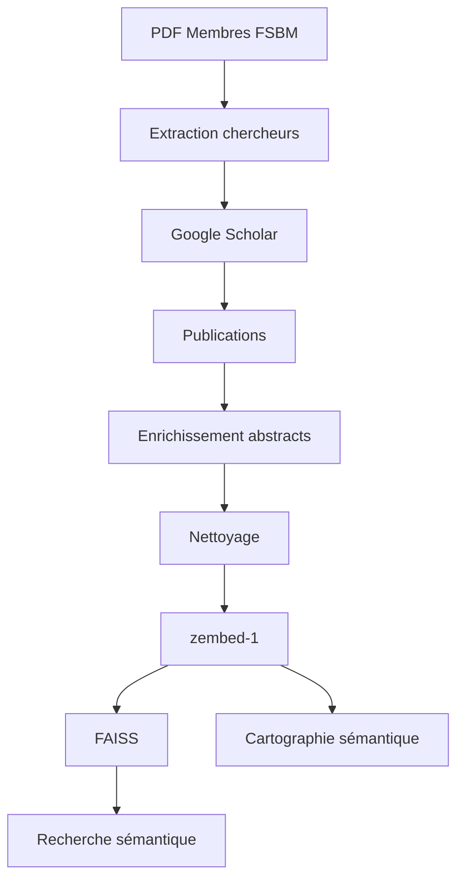

# Cartographie sémantique et analyse des publications de la FSBM

Projet de Master (Big Data / Data Science) — Faculté des Sciences Ben M'Sik (FSBM), Université Hassan II de Casablanca.

Le projet part de la liste officielle des enseignants-chercheurs de la FSBM (un PDF), retrouve leurs publications sur Google Scholar, les nettoie, les encode avec le modèle d'embedding **zembed-1**, puis permet de chercher des publications et des chercheurs par le sens plutôt que par mots-clés. Il produit aussi une carte des thèmes de recherche.



## Objectifs

1. extraire la liste des chercheurs FSBM depuis le PDF ;
2. retrouver leur profil Google Scholar, leurs métriques (citations, h-index, i10-index) et leurs publications ;
3. récupérer les abstracts (Scholar, puis Crossref, OpenAlex, Semantic Scholar) ;
4. nettoyer, dédupliquer et valider les données ;
5. encoder titre + abstract avec zembed-1 et indexer avec FAISS (similarité cosinus) ;
6. rechercher des publications et des chercheurs ;
7. produire une cartographie des publications (UMAP + KMeans) et des statistiques descriptives.

Les valeurs introuvables (abstract, DOI, métrique) restent vides, avec un champ `*_status` qui indique pourquoi. Rien n'est complété à la main ou par estimation.

## Technologies

Python 3.11 / 3.12, pandas, NumPy, PyArrow, pdfplumber, requests + BeautifulSoup, Pydantic, PyYAML, python-dotenv, sentence-transformers + PyTorch (zembed-1), FAISS, scikit-learn, UMAP, matplotlib, Plotly, Jupyter, pytest.

## Installation

```bash
python -m venv .venv
.venv\Scripts\activate          # Linux / macOS : source .venv/bin/activate
pip install -r requirements.txt
cp .env.example .env            # Windows : copy .env.example .env
```

Le fichier `.env` (jamais versionné) contient :

| Variable | Rôle |
|---|---|
| `CONTACT_EMAIL` | adresse de contact envoyée à Crossref et OpenAlex |
| `OPENALEX_API_KEY` | clé gratuite (openalex.org → compte → API key) ; sans clé le quota quotidien est partagé par tout le réseau et vite épuisé |
| `SEMANTIC_SCHOLAR_API_KEY` | optionnelle |
| `ZEROENTROPY_API_KEY` | inutile par défaut (voir la section zembed-1) |

Le PDF `Membres FSBM.pdf` se place dans `data/input/` (non versionné : document institutionnel).

## Exécution

```bash
python scripts/01_extract_members.py        # PDF -> data/raw/chercheurs_fsbm.csv
python scripts/02_scrape_scholar.py         # profils et publications Scholar
python scripts/03_clean_data.py             # nettoyage -> data/processed/
python scripts/04_generate_embeddings.py    # zembed-1 (GPU : voir ci-dessous)
python scripts/05_build_index.py            # index FAISS
python scripts/06_demo_search.py            # 5 requêtes de démonstration
python scripts/07_semantic_map.py           # cartographie
python scripts/08_descriptive_analysis.py   # graphiques
```

Chaque script accepte `--help`. Pour un essai rapide : `python scripts/02_scrape_scholar.py --limit-researchers 3 --max-publications 10`.

### Google Scholar

Le `robots.txt` de Scholar autorise les pages de profil (`/citations?user=ID`) mais interdit la recherche d'auteurs par nom et la pagination. Le script respecte ces règles : il ne visite que les profils dont l'identifiant Scholar est connu, à raison d'une requête toutes les 10 à 20 secondes, et vérifie chaque URL avant de l'envoyer. Les identifiants se renseignent dans `data/raw/scholar_overrides.csv` (`python scripts/02_scrape_scholar.py --init-overrides` crée le modèle). Si l'on dispose déjà d'une liste JSON `nom / identifiant`, `python scripts/import_scholar_ids.py` la rapproche du PDF et remplit ce fichier.

Quand Google bloque (HTTP 429, ou page « not a robot »), le script s'arrête en gardant tout ce qui a été collecté ; on relance plus tard avec la même commande. Il ne tente jamais de contourner le blocage.

Deux moyens de compléter les chercheurs manquants :

* **Pages enregistrées à la main.** On ouvre soi-même chaque profil dans le navigateur (en validant le contrôle « not a robot » si besoin), puis Ctrl+S (« Page Web, HTML uniquement ») dans `data/input/scholar_html/`. `python scripts/import_scholar_html.py --checklist` génère la liste cliquable des profils, et `python scripts/import_scholar_html.py` lit les fichiers enregistrés, sans aucune requête vers Google.
* **Repli OpenAlex** (`python scripts/02b_openalex_fallback.py`), décrit ci-dessous.

### Repli OpenAlex

OpenAlex est une base scientifique ouverte avec une API officielle (publications, abstracts, DOI, revues, citations, h-index). Elle sert pour les chercheurs sans données Scholar :

* un profil OpenAlex n'est retenu que si son nom est quasi identique et s'il est rattaché à l'Université Hassan II de Casablanca ; les homonymes importants sont écartés et les fragments d'un même auteur sont fusionnés ;
* les données sont étiquetées `data_source = "openalex"` (colonne du CSV, champ `source_donnees` du JSON, `scrape_status` de chaque publication) ;
* dès que Scholar fournit des publications pour un chercheur, ses données remplacent celles d'OpenAlex ;
* comparaison avec Scholar sur les 5 chercheurs collectés depuis Scholar (`python scripts/02b_openalex_fallback.py --validate`) : le bon profil est retrouvé 5 fois sur 5, et 74 % en moyenne des publications Scholar figurent dans OpenAlex (100 %, 87 %, 81 %, 100 %, 0 %). Les métriques OpenAlex sont un peu plus basses que celles de Scholar : on ne les présente pas comme des métriques Google Scholar.

### Embeddings zembed-1 sur GPU

zembed-1 compte 4 milliards de paramètres (~8 Go). Sur un portable sans GPU, l'encodage prend environ 2 minutes par publication (mesuré : plusieurs jours pour 2 000 publications). Les embeddings ont donc été calculés sur un GPU gratuit de Google Colab :

1. `python scripts/make_colab_bundle.py` crée `outputs/colab/colab_bundle.zip` (le code et `publications_clean.parquet` uniquement) ;
2. ouvrir `notebooks/02_colab_embeddings_gpu.ipynb` dans Colab (GPU T4), envoyer le zip, exécuter les cellules ;
3. décompresser le `zembed_outputs.zip` téléchargé dans `data/vector_store/`, puis `python scripts/05_build_index.py` (et `python scripts/04_generate_embeddings.py --attach-only` pour intégrer les vecteurs au JSON).

Les 5 requêtes de démonstration sont encodées en même temps et stockées dans le cache : `06_demo_search.py` s'exécute ensuite sans recharger le modèle. Une requête libre demande de charger les poids en local, ce qui est lent sans GPU.

## Structure

```
fsbm-semantic-publications/
├── config/settings.yaml          # paramètres (délais, seuils, modèle, k…)
├── data/
│   ├── input/                    # PDF et pages Scholar enregistrées (non versionnés)
│   ├── raw/                      # chercheurs_fsbm.csv, scholars_raw.json, publications_raw.json
│   ├── processed/                # *_clean.csv, publications_clean.parquet, dataset_final.json
│   └── vector_store/             # embeddings.npy, index FAISS, cache des requêtes
├── notebooks/                    # 01_pipeline_demo (démonstration), 02_colab_embeddings_gpu
├── src/
│   ├── data/                     # extraction du PDF, Scholar, OpenAlex, enrichissement, schémas
│   ├── preprocessing/            # nettoyage du texte et des données
│   ├── embeddings/               # client zembed-1
│   ├── search/                   # index FAISS, recherche sémantique
│   ├── analysis/                 # cartographie, statistiques
│   └── utils/                    # configuration, logs, retries
├── scripts/                      # 01 à 08, plus les scripts d'import et de repli
├── tests/                        # pytest (sans accès réseau)
└── outputs/{figures,logs,reports}
```

## Données

Trois tables : les chercheurs (`chercheurs_clean.csv`), les publications (`publications_clean.csv` et `.parquet`, une ligne par article) et le lien entre les deux (`researcher_publications.csv`). Un article co-signé par plusieurs chercheurs FSBM n'apparaît qu'une fois.

`dataset_final.json` suit le schéma demandé (les valeurs `null` ci-dessous illustrent la structure) :

```json
{
  "chercheur_id": "<identifiant Scholar>",
  "chercheur_id_interne": "fsbm_prenom_nom",
  "scholar_id": "<identifiant Scholar>",
  "nom_complet": "Prénom Nom",
  "affiliation": "…",
  "laboratoire": "…",
  "equipe": "…",
  "source_donnees": "google_scholar",
  "metriques": { "citations_totales": null, "h_index": null, "i10_index": null },
  "articles": [
    { "article_id": "art_00001", "titre": "…", "auteurs": ["…"], "date_publication": "2021-01-01",
      "journal": "…", "citations": null, "doi": null,
      "abstract": "texte brut", "abstract_clean": "texte nettoyé", "abstract_status": "found",
      "embedding_source": "title_abstract", "embedding_zembed1": ["…"] }
  ]
}
```

Champs de statut : `scholar_profile_status` (`matched`, `ambiguous`, `not_found`, `blocked`, `error`), `abstract_status` (`found`, `truncated`, `too_short`, `not_found`, `api_error`), `abstract_source`, `embedding_source` (`title_abstract` ou `title_only`, quand il n'y a pas d'abstract), `date_precision` (`day`, `month`, `year`).

Nettoyage : `abstract` est le texte brut ; `abstract_clean` est en minuscules, sans HTML, sans étiquette « Abstract » ni « … » de troncature, avec les symboles scientifiques conservés. On ne retire pas les stop-words et on ne fait pas de stemming, inutiles avec des embeddings modernes. Les doublons sont détectés par DOI, puis par titre et année, puis par similarité de titre (seuil 0,93) ; deux DOI différents ne sont jamais fusionnés. Un « abstract » qui n'est en réalité qu'une liste d'affiliations d'auteurs est écarté.

Le rapport qualité est dans `outputs/reports/data_quality_report.{json,md}`. Les embeddings, l'index FAISS et le JSON complet sont versionnés ; restent hors Git le `.env`, le PDF et le cache de collecte.

## Recherche sémantique

```python
from src.search.semantic_search import semantic_search
semantic_search("deep learning for medical imaging", top_k=5)
```

La requête est encodée par zembed-1 (`input_type="query"`, les publications l'ont été en `document`), puis comparée aux publications par similarité cosinus (vecteurs normalisés, `IndexFlatIP`). Chaque résultat donne le rang, le score, le titre, les chercheurs FSBM, l'année, la revue, le laboratoire, l'équipe, les citations, un extrait de l'abstract et le DOI.

Pour classer les **chercheurs**, on retrouve les 100 publications les plus proches puis on donne à chaque chercheur la moyenne de ses 3 meilleures similarités (une place vide compte 0). Un chercheur avec plusieurs publications proches passe ainsi devant un chercheur avec une seule publication très proche. Le classement repose uniquement sur les embeddings.

`python scripts/06_demo_search.py` exécute les 5 requêtes du sujet (deep learning for medical imaging, natural language processing, machine learning for cancer diagnosis, renewable energy materials, environmental pollution) et écrit `outputs/reports/demo_search_results.{md,json}`.

## Le modèle zembed-1

zembed-1 est développé par ZeroEntropy, qui n'accepte plus de nouvelles inscriptions à son API. Le modèle reste publié en poids ouverts, et c'est ce que le projet utilise : le même zembed-1, exécuté directement. Le client refuse tout autre nom de modèle.

| Point | Valeur |
|---|---|
| Poids | `zeroentropy/zembed-1-embedding` (Hugging Face), licence Apache-2.0, 4 milliards de paramètres, base Qwen3-4B, révision épinglée (`cf13c81f…`) |
| Chargement | `SentenceTransformer(..., trust_remote_code=True)` ; `encode_query` pour les requêtes, `encode_document` pour les publications |
| Code distant | `modeling_zembed.py` (20 lignes, relues) : ajoute un marqueur de fin de texte puis tokenise |
| Dimension | 2560 par défaut (Matryoshka : 1280 à 40), lue sur les vecteurs produits (`embedding_run.json`) |
| Longueur | limitée à 512 tokens ici (titre + abstract : 150 à 400 tokens) ; le modèle accepte 32 768 |
| Précision | bfloat16 ou float16 selon le GPU ; les NaN sont détectés |
| API hébergée | `POST https://api.zeroentropy.dev/v1/models/embed` (transports `sdk` et `http`, optionnels, clé nécessaire) |

Le client gère les lots, les erreurs de mémoire, les NaN, un cache SQLite sauvegardé après chaque lot et la reprise après interruption.

## Résultats

**Extraction du PDF.** 215 lignes extraites, égales aux 215 annoncées en pied de page, numérotées de 1 à 215 sans trou ni doublon. On compte 207 membres FSBM (et 8 d'autres établissements, gardés dans le fichier brut : FSJESAS 3, FLSHBM 2, ENCG 2, FMPC 1), 11 laboratoires et 42 équipes FSBM.

**Jeu de données final.**

| Indicateur | Valeur |
|---|---|
| Chercheurs FSBM dans le PDF / avec un identifiant Scholar | 207 / 86 |
| Chercheurs avec publications | 79, répartis sur les 11 laboratoires |
| dont source Google Scholar / OpenAlex | 5 / 74 |
| Chercheurs sans données | 7 (2 profils OpenAlex ambigus, 2 introuvables, 3 sans profil rattaché à Hassan II) |
| Publications uniques (171 doublons entre co-auteurs fusionnés) | 1 591 (1 728 liens chercheur–publication) |
| Avec DOI | 1 522 (95,7 %) |
| Avec abstract | 1 122 (70,5 %) ; les 469 autres sont encodées par leur titre seul |
| Origine des abstracts | OpenAlex 987, Semantic Scholar 74, Google Scholar 40, Crossref 21 |
| Erreurs de validation | 0 |
| Embeddings zembed-1 | 1 591 × 2 560, aucun NaN (GPU T4, float16) |

**Pourquoi 74 chercheurs viennent d'OpenAlex.** Google Scholar a limité l'accès (HTTP 429, puis un contrôle « not a robot ») après quelques dizaines de requêtes, malgré un rythme prudent. Deux conséquences : les métriques de ces 74 chercheurs sont celles d'OpenAlex (`source_donnees` les distingue), et chaque chercheur est limité à ses 30 publications les plus citées, donc les classements décrivent le jeu collecté et non la production totale de la FSBM.

**Exemples de recherche** (`outputs/reports/demo_search_results.md`). « natural language processing » ramène des travaux sur BERT et l'analyse de sentiments, et place parmi les chercheurs E. H. Benlahmar, O. Zahour, A. Daif et S. El Filali. « renewable energy materials » ramène des pérovskites et des cellules solaires ZnO/CuO. « environmental pollution » ramène la qualité des eaux souterraines et l'acidification côtière.

**Cartographie.** Projection UMAP en 2D (métrique cosinus) puis KMeans. Les scores de silhouette sont presque identiques pour tous les k (0,03 à 0,04) : les thèmes forment un continuum plutôt que des groupes nets. On a donc fixé k = 8 pour une carte lisible (`semantic_map.n_clusters`) ; ce n'est pas un choix optimisé. Chaque groupe est décrit par ses termes TF-IDF les plus caractéristiques et ses titres les plus centraux. Ces groupes sont un découpage mathématique, pas une classification officielle des disciplines.

Figures : `outputs/figures/` (graphiques 01 à 08 et cartes `semantic_map_*`, dont une version interactive en HTML).

## Limites

* Google Scholar limite l'accès automatisé et peut changer son HTML (les sélecteurs sont regroupés dans `src/data/scholar_parsing.py`). Ses conditions d'utilisation restreignent l'accès automatisé, et l'option `--allow-author-search`, qui recherche les profils par nom, va à l'encontre de son `robots.txt` : elle est désactivée par défaut.
* La majorité des chercheurs (74 sur 79) vient d'OpenAlex : couverture différente de Scholar (74 % des publications Scholar retrouvées sur l'échantillon comparé) et métriques plus basses.
* 30 publications au maximum par chercheur, 7 chercheurs sans données, 29,5 % des publications sans abstract.
* Les citations évoluent : les valeurs datent de la collecte.
* Le PDF écrit certains noms collés (`ELHABIB.BENLAHMAR`) alors que Scholar les sépare (« El Habib Ben Lahmar ») ; la comparaison de noms ignore donc l'ordre, les accents et le découpage des mots. Des homonymes stricts ne peuvent pas être distingués.
* Le PDF est une impression de page web : l'extraction se fait par coordonnées de mots, avec un contrôle de cohérence (numéros 1 à N et total annoncé). Si la mise en page change, le script signale des avertissements ; `--inspect` aide à diagnostiquer.
* Sur Scholar, une cellule « Cité par » vide signifie 0 citation ; la valeur « * » (non fournie) devient `None`.
* Les tests simulent les pages Scholar, les blocages et les API ; la collecte réelle a été essayée sur quelques profils, dont celui de E. H. Benlahmar, et ses résultats correspondent à ce qu'affiche Scholar.
* Sans GPU, zembed-1 est trop lent pour tout le corpus (voir plus haut).

## Reproductibilité

* `random_state = 42` (UMAP, KMeans, PCA) ;
* `requirements.txt` donne les versions minimales et `requirements.lock.txt` les versions exactes utilisées (Python 3.12) ;
* toute la configuration est dans `config/settings.yaml` ; les caches rendent les exécutions reprenables ;
* les identifiants de chercheurs sont déterministes (`fsbm_prenom_nom`) ; les `article_id` sont numérotés après tri par titre et peuvent changer si le corpus change ;
* `python -m pytest` lance les tests, sans accès réseau, sans téléchargement de modèle et sans clé API.

## Auteurs

Projet réalisé par Nouhaila ELHOUMA — Master Big Data / Data Science, Faculté des Sciences Ben M'Sik (FSBM), Université Hassan II de Casablanca.

Encadrant : Pr. El Habib BENLAHMAR.

Licence : MIT (voir `LICENSE`).
